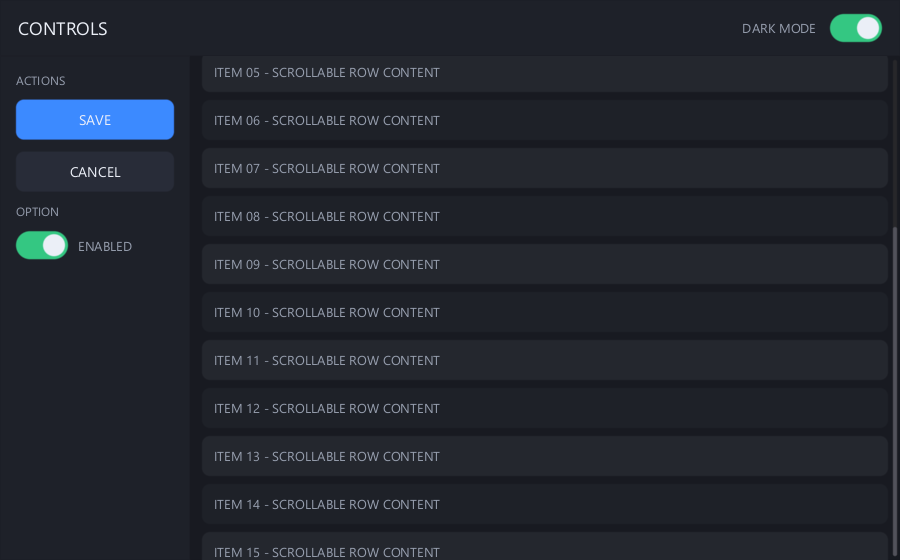
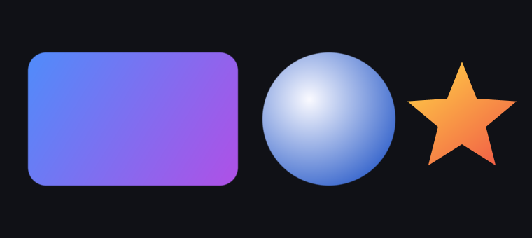
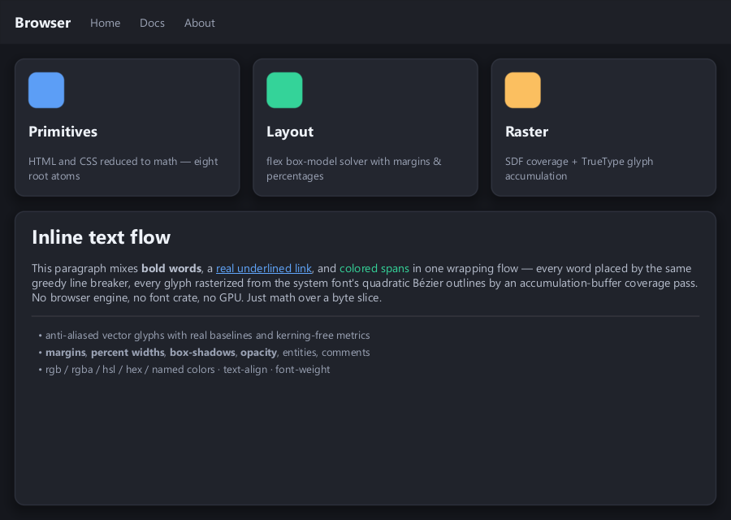
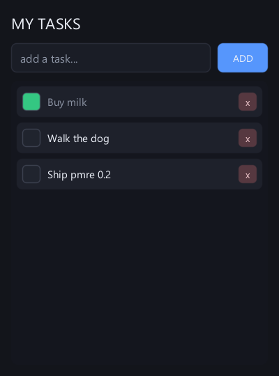

# Atom Rendering Engine

[](https://github.com/Lucerna-Labs/atom-rendering-engine/actions/workflows/ci.yml)

A [Lucerna Labs](https://github.com/Lucerna-Labs) project. Created by [Jesse G. Alicea](https://github.com/Rekonquest).
**Building on the engine?** Start with the [Developer Guide](docs/DEVELOPER_GUIDE.md).
Provider-backed app generation must also follow the [Provider Runtime Requirements](docs/PROVIDER_RUNTIME.md).

A from-scratch 2D UI rendering engine built **entirely from mathematical primitives** —
no GPU vector library (no Vello, Skia, or Cairo), no web engine, no Tauri/Electron. Shapes
are rasterized from signed-distance fields with analytic anti-aliasing, arbitrary contours
from a scanline path filler, and text from **real TrueType outlines** — a built-in
zero-dependency `.ttf` parser + accumulation-buffer glyph rasterizer that reads the system
font with `std::fs` (bitmap-font fallback when none exists). It composites, lays out, and
runs an interactive widget loop entirely on the CPU.



## The shape of it

Focused crates, with the same kit/orchestrator ownership boundary:

- **`pmre-kit`** — *the kit*: all the dumb, decision-free mechanism. The eight root atoms
  (`scan · hash · fold · project · scale · compare · combine · order`), geometry + affine
  transforms, SDF coverage + smoothstep anti-aliasing, a scanline path rasterizer (fills and
  strokes), two-stop gradients, alpha-over compositing, a TrueType parser + anti-aliased
  glyph rasterizer (with a bitmap fallback tier), rich inline text flow, the reduced
  flex/box layout solver (margins, percentages, drop shadows), hit-testing, and clipping.
  Zero external dependencies.
- **`pmre-orchestrator`** — *the orchestrator*: all policy, no mechanism. Painter order, the
  interaction state machine (hover / press / click / toggle / scroll / drag), scrollbars, and
  the resize loop. It drives the kit; it never touches a pixel itself. Zero dependencies by default
  (the optional `gpu` feature adds wgpu for the GPU bloom tier).
- **`pmre-font`** — dependency-free TrueType parsing and glyph rasterization.
- **`pmre-html`** — reduced HTML/CSS parsing into the PMRE UXI tree.
- **`pmre-examples`** — example programs and artifact renderers kept outside runtime crates.

The pipeline is pure composition all the way to pixels:

```
intent (UxNode, no coordinates)  ─┐
HTML + reduced CSS  ──────────────┼─►  reduced layout (box-model + block/flex)
                                       └─►  drawing primitives (the "math")
                                            └─►  SDF / scanline coverage + alpha-over  ─►  framebuffer
```

Every step maps onto a root atom: `project` transforms points, `compare` is the SDF distance,
`smoothstep` is the anti-aliased coverage, `combine` is Porter-Duff *over*, `order` is the
painter's algorithm.

## Features

- **Shapes** — rect, rounded-rect, circle, line via signed-distance fields with exact AA.
- **Paths** — fill and stroke arbitrary polygons and flattened Béziers (scanline rasterizer,
  nonzero winding so holes and self-overlap work; round joins and caps on strokes).
- **Gradients** — two-stop linear and radial, sampled per pixel.
- **Text** — anti-aliased vector glyphs from the system TrueType font (`cmap` 4/12, simple
  + composite `glyf` outlines, real advances and baselines), rasterized by a font-rs-style
  accumulation buffer and cached per size; rich inline flows mix bold / underlined /
  colored spans in one wrapping paragraph. Falls back to the built-in bitmap font when no
  font file exists — still zero crates either way.
- **Layout** — a reduced CSS-flexbox/block solver: row/column, `Auto`/`Px`/`Flex`/`%`
  sizing, padding, **margins**, gap, align, justify, borders, radius, and soft
  **box shadows** (wide-band SDF falloff). Author intent; positions are *derived*.
- **Two front-ends, one core** — a UXI intent tree and an HTML/CSS document reduce onto the
  same box-model + layout + paint core. The HTML side handles comments, entities,
  `<script>`/`<style>` skipping, inline elements coalescing into one text flow, lists,
  `hr`, and a wide CSS subset (rgb/rgba/hsl/hex/named colors, text-align, font-weight,
  opacity, box-shadow, per-side margin/padding).
- **Interaction** — buttons (hover / press / click), toggles, a scrollable region with clipping,
  a live scrollbar (wheel scroll **and** thumb drag), hit-testing, and auto-resize reflow.
- **Text input** — focusable fields with typed characters, backspace, a caret, and Enter-to-submit.
- **Live window, zero dependencies** — the interactive todo window (`examples/app.rs`) drives the
  OS window **directly via raw Win32/GDI FFI** — no winit, no softbuffer, no crates — blitting the
  CPU framebuffer to the screen with real mouse, wheel, keyboard, and resize events. It is
  **per-monitor DPI aware**: layout solves in logical units and paints at native pixels, so
  glyph edges stay crisp on hi-DPI displays instead of being bitmap-stretched by Windows.

| Paths & holes | Gradients | Strokes |
|---|---|---|
|  |  |  |

An HTML document with inline CSS, rendered by the engine — inline bold/link/colored text
wrapping in one flow, box shadows, lists, and system-font glyphs, with no browser engine:



## Real apps

Two self-verifying apps are built on the engine — a calculator and a todo list — exercising
layout, buttons, toggles, scroll, **text input**, and click handling end to end. Each drives a
real interaction sequence through the engine and asserts the result before rendering.



The todo list also runs as a **live, interactive, zero-dependency window** —
`cargo run -p pmre-examples --example app` — where you type tasks, press Enter to add, click
the box to check one off, and `x` to delete. The window itself is raw Win32/GDI, no crates.

## Build & run

```sh
# Static renders
cargo run -p pmre-examples --example demo        # SDF shapes
cargo run -p pmre-examples --example paths       # fills: star, donut (hole), Bézier blob
cargo run -p pmre-examples --example stroke      # strokes: outlined star, polyline, curve
cargo run -p pmre-examples --example gradients   # linear + radial gradients
cargo run -p pmre-examples --example uxi         # a UXI dashboard
cargo run -p pmre-examples --example html        # HTML/CSS reduced to primitives
cargo run -p pmre-examples --example calc        # a working calculator (real app)
cargo run -p pmre-examples --example todo        # a todo app: type, add, check, delete (real app)
cargo run -p pmre-examples --example math_atoms_coder # Math Atoms Coder proof artifact

# Interaction, driven headlessly to image frames
cargo run -p pmre-examples --example ui

# Live interactive window (real mouse / wheel / resize / scrollbar drag)
cargo run -p pmre-examples --example app
```

Each headless example writes its image to the working directory. **The default build pulls in no
dependency** — `cargo tree` shows the whole workspace, library *and* examples, depending on zero
external crates (the optional `gpu` feature adds `wgpu` for GPU-accelerated bloom). The live
window (`app`) calls the OS windowing API directly via raw FFI.

## Tests

```sh
cargo test --workspace        # rasterizer, gradients, stroking, layout coverage
cargo clippy --workspace --all-targets -- -D warnings
```

## Footprint

Because the default build has zero dependencies, the binaries are tiny: a complete UI app
compiles to **~150-400 KB** (the calculator and HTML demos are ~0.34 MB). Enabling the optional
GPU bloom tier links `wgpu`, which brings a GPU-using binary to **~7.7 MB** - the entire
difference is wgpu. For typical 2D UI the CPU path is what you want; the GPU tier is there for
heavier effects later without swapping the renderer.

## License

MIT — see [LICENSE](LICENSE).
